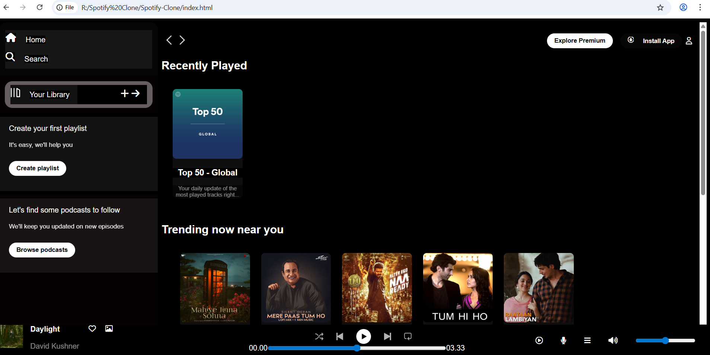
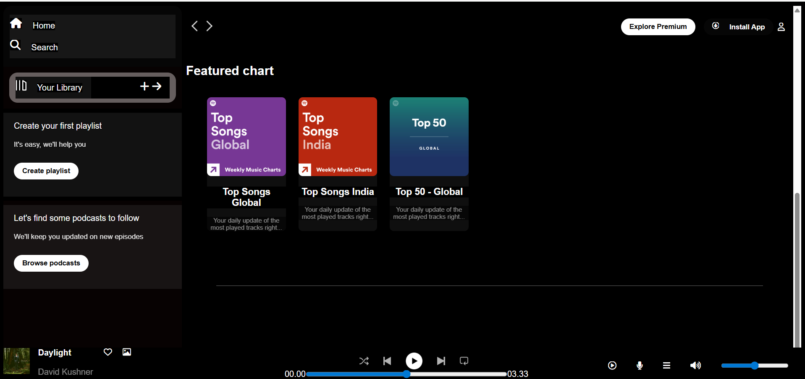

# 🎵 Spotify Clone

A simple front-end clone of Spotify built using HTML and CSS. This project replicates the look and feel of Spotify's homepage and basic layout components.

## 📸 Screenshots

## 🛠️ Technologies Used

- HTML5
- CSS3

## 📌 How to Use

1. Clone the repository:https://github.com/ritvik89/Spotify-Clone.git
2. Open `index.html` in your browser.

## 📬 Contact

If you'd like to connect or suggest improvements, feel free to reach out!

--

